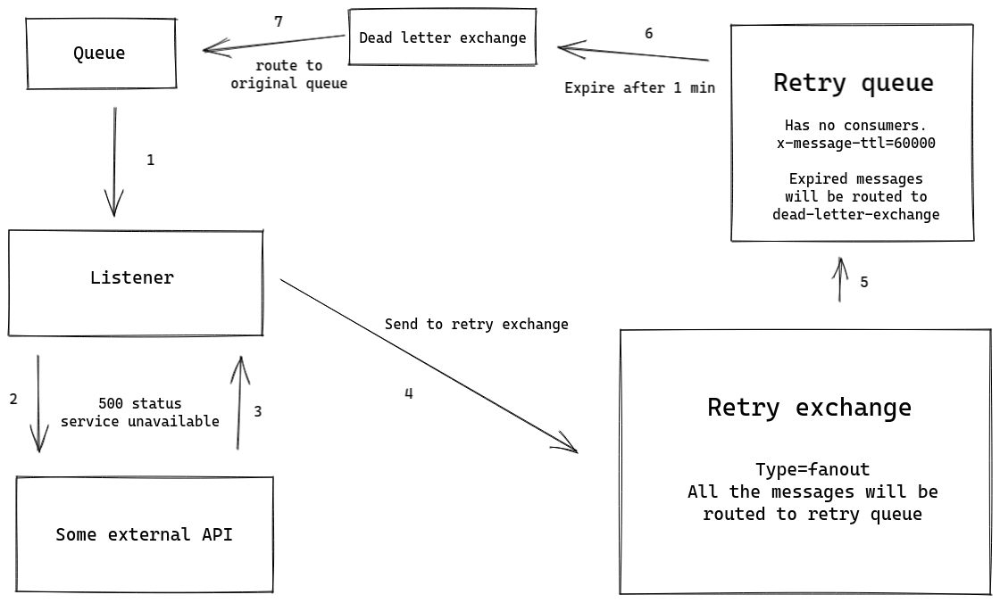

<!DOCTYPE html>
<html lang='en'>
<head>
  <meta charset='utf-8'>
  <meta content='width=device-width, initial-scale=1.0' name='viewport'>
  <title>Delayed retry RabbitMQ</title>
  <link rel="stylesheet" href="base.css">
</head>

# Delayed retry with RabbitMQ

Dec 12, 2020

Let's imagine an application with a listener which receives messages from RabbitMQ's
queue. At that point application sends a http request to some API but it responds
with 500 status. What to do? Well, sometimes it's ok, logging the error is enough.
But sometimes application should retry this request later, when API will be available.

So, here I want to show how delayed retry logic can be implemented using a RabbitMQ's
features called <em>dead letter exchange</em> and <em>message expiration</em>.

[Dead letter exchange](https://www.rabbitmq.com/dlx.html) is actually an ordinary
exchange. It can be of any type and can be defined for any queue. If the queue has
a messages expired due configured TTL then this messages will be routed to the
dead-letter-exchange.

I believe [message expiration](https://www.rabbitmq.com/ttl.html) does not need
explanation. It can be configured on queue level using <em>x-message-ttl</em>
parameter or specified on per-message basis using message parameters. RabbitMQ
server will try to remove messages at or shortly after their TTL-based expiry.

I'm strongly recommend to read the official RabbitMQ docs about these topics
after finishing this article.

## Retry scheme

There is a diagram explaining the main idea

Example application can be found at [github.com/misc/rabbitmqretry](https://github.com/ukarim/misc/tree/master/rabbitmqretry)
